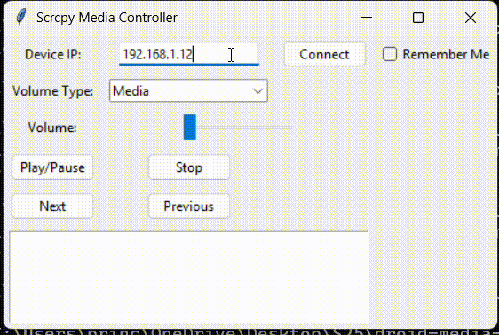

# Scrcpy Media Controller

This Python application provides a graphical interface to control the media playback and volume of an Android device using `scrcpy` over a local network.



## Features

* **Remote Media Control:** Play/pause, stop, next track, and previous track.
* **Volume Control:** Adjust volume for different audio streams (Media, Call, Ring, Alarm, System).
* **Discrete Volume Steps:** Volume slider adjusts in discrete steps based on the Android device's volume levels.
* **Smooth Volume Slider:** Volume commands are delayed until the slider stops moving for a smoother experience.
* **Debug Output:** A text area displays debug information.
* **Autoconnect:** Option to automatically connect to a previously used IP address.
* **IP Address Persistence:** Saves the IP address for autoconnect in a file.


## Prerequisites

* **Python 3:** Ensure you have Python 3 installed.
* **ADB (Android Debug Bridge):** ADB must be installed and configured on your system's PATH. You can install it using `winget install Google.PlatformTools` on Windows, or download it from the Android SDK Platform-Tools.
* **Scrcpy:** Scrcpy must be installed. You can download it from the official GitHub repository: [https://github.com/Genymobile/scrcpy](https://github.com/Genymobile/scrcpy).
* **Android Device:** Your Android device must have USB debugging enabled and ADB over TCP/IP enabled.

## Setup

1.  **Clone the Repository:**
    ```bash
    git clone [repository_url]
    cd [repository_directory]
    ```

2.  **Create a Virtual Environment (Recommended):**
    ```bash
    python -m venv venv
    ```

3.  **Activate the Virtual Environment:**
    * **Windows:**
        ```bash
        venv\Scripts\activate
        ```
    * **macOS/Linux:**
        ```bash
        source venv/bin/activate
        ```

4.  **Install Required Libraries:**
    ```bash
    pip install tk
    ```

5.  **Enable ADB over TCP/IP:**
    * Connect your Android device to your computer via USB.
    * If prompted, press "Allow" on your Android device
    * Open a terminal and run `adb tcpip 5555`.
    * Disconnect your Android device from the USB cable.
    * Find your Android device's IP address (Settings > About phone > Status > IP address).

## Running the Application

1.  **Run the Python Script:**
    ```bash
    python main.py
    ```

2.  **Enter IP Address:**
    * Enter your Android device's IP address in the "Device IP" field.
    * Check the "Autoconnect" box if you want to automatically connect to this IP next time.

3.  **Connect:**
    * Click the "Connect" button.

4.  **Control Media and Volume:**
    * Use the buttons and volume slider to control your Android device.
    * Select the volume type from the combobox.

5.  **View Debug Output:**
    * The debug text area will display connection status and volume changes.

## Notes


* The volume step counts in the code might need to be adjusted based on your Android device's volume levels.
* Ensure your Android device and computer are on the same local network.
* If the IP address of the android device changes, you will need to reconnect.
* For best performance, use a 5 GHz Wi-Fi network.
